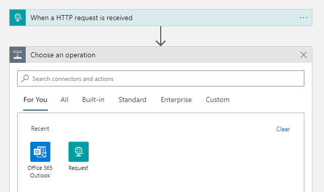
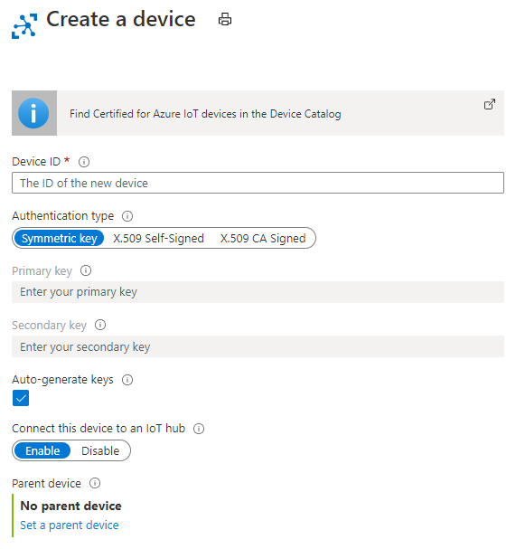
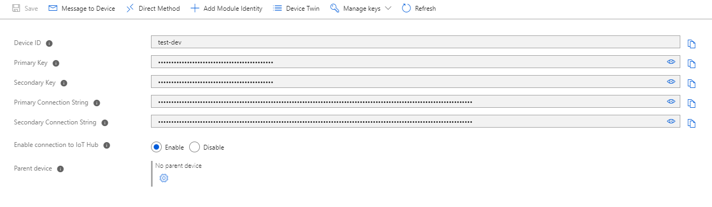

# Azure Powered AI Freezer Monitor

The Azure Powered AI Freezer Monitor is a maker hardware based IoT monitor that uses machine learning, or ML, to provide early warnings of potential equipment failure. This guide covers building the device, collecting training data, setting up email alerts, training a custom auto encoder machine learning model, and deploying the model to an ESP32 development board. 

The project is designed to be functional for low temperature scientific freezers (-60 C), with the goal of reducing  catastrophic failure and the need to keep backup freezers running full-time. However, please note that this project is primarily for demonstrative and educational purposes and has not gone through extensive testing. 

>This project takes about two to three hours to fully complete. Please note that the device will need to passively collect temperature data for about 30 days before you will be able to train the model.

## Prerequisites

1. Free Azure Account
1. VS Code with the Arduino extension installed
1. Hardware specified below (if you'd like to use a different device refer to the [message specifications](#message-spec))

### Materials and Tools

|Materials | Description | Vendor |
|-----|-------------|------|
| Adafruit Feather Huzzah32 (a) | WiFi enabled ESP32 based prototyping board| [Adafruit](https://www.adafruit.com/product/3591)
| Adafruit MCP9600 (b) | I2C Thermocouple amplifier| [Adafruit](https://www.adafruit.com/product/4101) |
| Adafruit Type K Thermocouple (c) | 2 wire thermocouple effective temperature ranger -200c to 800c +/-2c| [Adafruit](https://www.adafruit.com/product/3245) |
| Jumper Wires (d) || [Adafruit](https://www.adafruit.com/product/1956) |
| Breadboard (e) || [Adafruit](https://www.adafruit.com/product/64) |
| Micro USB cable | Used to power the ESP32 board | [Adafruit](https://www.adafruit.com/product/2185) |
| USB Power Supply || [Adafruit](https://www.adafruit.com/product/501)|
|**Tools**|||
| 00 Philips Head Screw Driver |||
| Soldering Iron |||


## Up and running in 5 minutes

There are details below about the cost and architecture of this sample, but if you just want to get it running right away here are the steps to get started. 

### Azure Setup

#### Deploy Resources
1. Log in to your Azure account
1. Click the **Deploy to Azure** button below to provision all the resources for this project
1. Create a new resource group for the project
1. Select a region for the your resources, choose one that near you for the best performance
    > *Note: Some resources aren't available in all regions.*
1. Provide names for all the resources

#### Configure Logic App
1. Once the deployment is complete use the left navigation to open the newly created Logic App
1. Select *Logic app designer* from the left navigation
1. Select *+ New step*
1. Search for the email client you'd like to use (Office 365 Outlook, Gmail, and Outlook.com)
    
1. Select the *Send an email* action
    > *Note: This will be a little different depending on which email client you use*
1. Log in with your email account
1. Customize your message, this email will be sent any time an anomaly is detected.

#### Set up IoT Device
1. Next you'll need to get the connection string for you device, navigate to the IoT Hub you created earlier
1. In the left navigation select *IoT devices*
1. At the top left of the page select *+ New*
1. Give the device an ID
    
1. Press *Save* at the bottom of the screen
1. Select the device you created
1. Copy the *Primary Connection String* you'll use this string in the next section
    

[]()

### <a name="device-build"></a> Device Build


#### Build

1. Solder the screw terminal to the top side of your MCP9600.
    
1. Solder the pins to the bottom side of the MCP9600.  
    > *Tip: Put the pins in the breadboard to hold them in place when soldering.*

    
1. Insert the ESP32 and thermocouple amplifier into the breadboard.
1. Follow the wiring diagram below to connect the thermocouple amplifier to the ESP32 using your jumper wires.
    

1. Connect the Thermocouple to the screw terminals on the MCP9600
    > The picture below use a generic ESP32 Dev board, new picture with the Adafruit Huzzah32 coming soon!
    
     

#### Code

1. If you haven't already, clone this repo to your computer
1. Open the *AiFreezer* folder with VS Code
1. Create a new file in this folder and name it *config.h*
1. Paste the code below in *config.h*
    ```c++
    const char* ssid     = "<YOUR-NETWORK-NAME>";
    const char* password = "<YOUR-WIFI-PASSWORD>";

    static const char* connectionString = "<YOUR-CONNECTION-STRING>";
    ```
1. Fill in your network credentials
1. Paste the connection string from IoT Hub
1. Follow the first section of this [guide](https://randomnerdtutorials.com/installing-the-esp32-board-in-arduino-ide-windows-instructions/) to add the ESP32 extension to the Arduino IDE.

1. Install the library listed below using Arduino's Library manager. If you have used the library manager before [here](https://www.arduino.cc/en/guide/libraries) is a helpful guide.
    1. Adafruit MCP9600
    > Note: If you're prompted to install other dependencies for these libraries, select *Install All*

1. With FreezerTempAlert.ino open in the VS Code open the command palette (CTL+SHIFT+P) and type in **Arduino: Change Board Type** then search **Adafruit ESP32 Feather**

1. Next select the the active serial port, open the command palette and type in **Arduino: Select Serial Port**

1. Finally upload your code to your Feather board, open the command palette and type in **Arduino: Upload**

## Cost

While an Azure account is free, using resources will incur a cost. Some of the resources offer a free version, we've compiled an estimate costs to run this project per month. If your account is new you should receive a $200 credit which should cover about five and a half years of these services.

| Resource | Free Tier | Cost |
|----------|-----------|------|
| IoT Hub  | Yes | $0 |
| Azure Functions | Yes | $0 |
| Azure Table Storage | No | $1 |
| Anomaly detection cognitive service | Yes | $0 |
| Logic Apps | No | $1 |
| **Total** || **~$2** |

### Azure Budgets

It's a good idea to also set up a budget for resource group (don't worry if you don't know what all these terms mean yet, we'll explain everything as we go). We've included a budget set at $5/mo as part of the Azure template, but if you want to learn more about costs on Azure, [here](https://docs.microsoft.com/en-us/azure/cost-management-billing/costs/quick-acm-cost-analysis) is a good starting place.

## Azure Resources

Resources are what tools and services on Azure are called. You'll use a variety of resources for this project. Some of them for compute, some for storage, others are hubs that act as connectors. Below is a list of the resources used in this project and links to where you can learn more about them.

| Resource | Description|
|----------|-----------|
| [IoT Hub](https://azure.microsoft.com/en-us/services/iot-hub/)| Managed service for bidirectional communication between IoT devices and Azure
| [Azure Functions](https://azure.microsoft.com/en-us/services/functions/) | Event-driven serverless compute platform |
| [Azure Table Storage](https://azure.microsoft.com/en-us/services/storage/tables/) | NoSQL key-value store |
| [Anomaly detection cognitive service](https://azure.microsoft.com/en-us/services/cognitive-services/anomaly-detector/) | An AI service that helps you foresee problems before they occur |
| [Logic Apps](https://azure.microsoft.com/en-us/services/logic-apps/) | No code platform for integration solutions |
| **Total** || **~$2** |


## <a name="message-spec"></a> Message Specification

The message sent from your device should be a JSON formatted string and needs to include a device id as a string and the temperature reading as a float.

```json
{"deviceId":"ESP32_device", "temperature": 25.235}
```

The anomaly detection service expected message to be evenly timed. Using a delay or an internal counter on the device is not sufficient, we recommend using an NTP server to synchronize the time the messages are sent.

# Contributing

This project welcomes contributions and suggestions.  Most contributions require you to agree to a
Contributor License Agreement (CLA) declaring that you have the right to, and actually do, grant us
the rights to use your contribution. For details, visit https://cla.opensource.microsoft.com.

When you submit a pull request, a CLA bot will automatically determine whether you need to provide
a CLA and decorate the PR appropriately (e.g., status check, comment). Simply follow the instructions
provided by the bot. You will only need to do this once across all repos using our CLA.

This project has adopted the [Microsoft Open Source Code of Conduct](https://opensource.microsoft.com/codeofconduct/).
For more information see the [Code of Conduct FAQ](https://opensource.microsoft.com/codeofconduct/faq/) or
contact [opencode@microsoft.com](mailto:opencode@microsoft.com) with any additional questions or comments.
